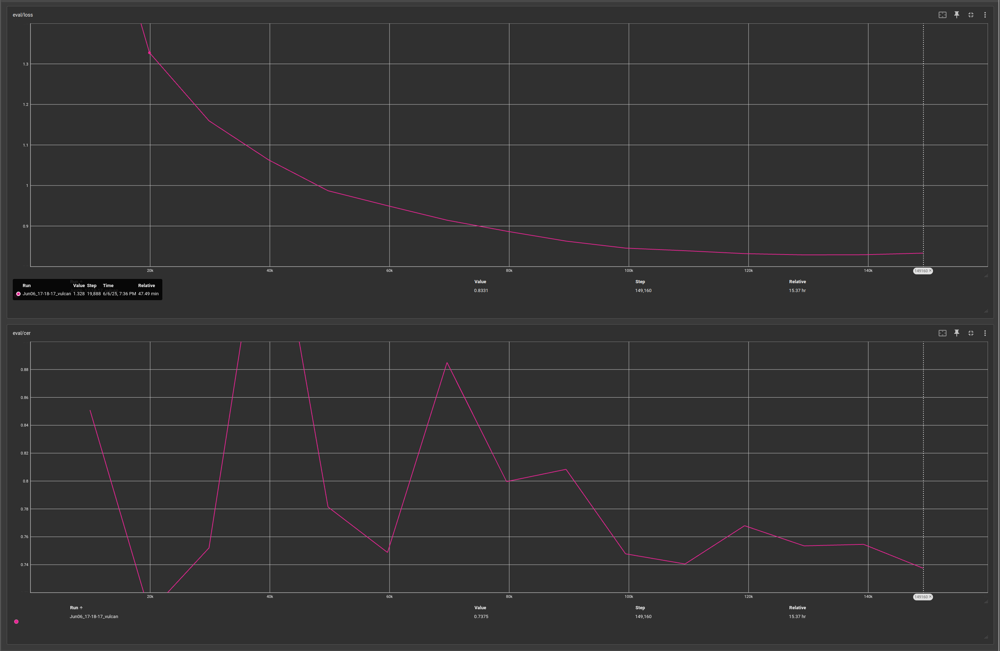

# Handwriting to Markdown 
Small project to turn handwritten math notes into Markdown format notes with LaTeX math notation.

This project uses a visual encoder-decoder transformer model.
It encodes images of handwritten math using a Visual Transformer into a latent vector, which it then decodes using Natural Language decoder into LaTeX notation.

## Setup
Assuming target system has CUDA capable graphics card with CUDA toolkit, python3-pip, python3-venv, installed 

### Start venv, install requirements
- ```python3 -m venv .venv```
- ```source .venv/bin/activate```
- ```pip install -r requirements.txt```

## Datasets
https://www.kaggle.com/datasets/shahrukhkhan/im2latex100k

## Evaluation
